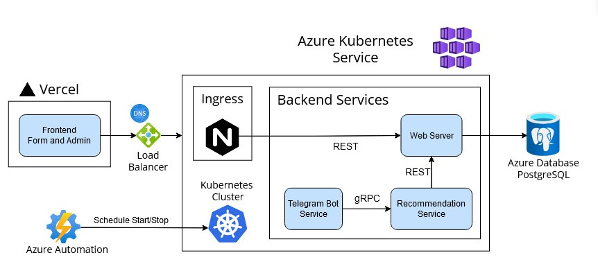

# Go Eats
A food recommender system using a content-based filter ML model.
This project consists of many components as part of a microservice architecture:

| Component              | Repo                                                                                           |
|------------------------|------------------------------------------------------------------------------------------------|
| Telegram Bot           | [/botservice](https://github.com/bentohset/go-eats/tree/main/botservice)                       |
| ML Model               | [/recommendationservice](https://github.com/bentohset/go-eats/tree/main/recommendationservice) |
| Form + Admin Dashboard | [go-eats-form repo](https://github.com/bentohset/go-eats-form)                                 |
| REST Web Server        | [go-eats-server repo](https://github.com/bentohset/go-eats-server)                             |
Refer to the README in each folder/repo for more developer details


> **_NOTE:_**  The system is offline from 12 midnight to 11am due to budget constraints

To demo: [telegram bot](https://t.me/goeats_bot) or search for `@goeats_bot` in Telgram!

## Table of Contents
- [About](#about)
  - [Motivation](#motivation)
  - [Features](#features)
  - [Tech Stack](#tech-stack)
  - [Architecture](#architecture)
- [Screenshots](#screenshots)
- [Setup](#setup)
- [Plan](#project-plan)
  - [Scope](#scope)
  - [User stories](#user-stories)
  - [Phases](#phase)
  - [Planned Features](#planned-features)
  - [Deployment](#deployment)

## About
### Motivation
This project came about the problem of deciding for a food place as a group. Due to undecisiveness, only vague preferences for a food place is decided like cuisine dont-wants, budget, etc and not the actual place. Go Eats solves this problem by recommending a food place based on these vague preferences.

### Features
1. Telegram bot for easy access which queries for preferences
2. Machine learning based recommendations
3. Form for user submission of reviews for data collection
4. Admin portal for approval and preprocessing of reviews

### Tech Stack
| Component        | Tech                               |
|------------------|------------------------------------|
| Telgram Bot      | Golang, gRPC                       |
| ML Model         | Python, scikit-learn, gRPC         |
| Form + Dashboard | Next.js, React, TailwindCSS        |
| Web Server       | Golang, REST API                   |
| Deployment       | Docker, Kubernetes, AKS, Terraform |
| Database         | Azure Database for PostgreSQL      |

### Architecture
Microservices Architecture with Kubernetes was adopted


## Screenshots
TBA

## Setup
Clone this repo
Refer to individual README for specific setups

Set .env variables:
```
DOCKER_PASSWORD=<dockerhub password for image repo>
```

For dockerizing, some commands:
```
docker-compose build <name(optional)>
docker-compose push <name(optional)>
docker-compose up <name(optional)>
```
docker-compose deployment names:
- recommendation-service
- bot-service


## Project Plan
### Scope
**Telegram bot** - Get user preferences for food, recommends places
- based on mealtime (breakfast, brunch, lunch or dinner)
- don't-wants, cuisines the user would not want
- budget
- mood (comfort, energy, indulgent, healthy, adventurous(out-of-user prefs))

**OpenAI API** - get dish recommendations

**PostgreSQL** - To store restaurants and reviews
- Places:
  - name
  - budget
  - moods
  - cuisine types
  - location
  - summary
- Reviews:
  - name
  - review

**Recommendation Algorithm**
- Data collection
  - Manual entry (import from current spreadsheet)
  - Web scraper and Google Maps API
  - Allow users to recommend restaurants through a form, pending approval and edits from admin
- Model
  - Content-based filter
  - Vectorize text TF-IDF on reviews to recommend similar restaurants
- Server
- Improvements
  - periodically retrain model by fetching data from DB

**Web form** - allow users to submit restaurant reviews
- Name of place (auto complete with Google Maps API) only in SG
- isChain (nullifies location parameter under the hood)
- Average budget
- Mood dropdown single select
- Cuisine dropdown multiple
- Mealtime dropdown multiple
- Rating stars out of 5

**Admin Dashboard**
- pending table
  - able to edit, delete and approve
- approved table
  - able to edit and delete
  - pagination
  - sort by column

### User stories
- As an indecisive user I want to get food recommendation based on my mood and budget
- As an adventurous person I want to get food outside my comfort zone
- As a meticulous person I want to see which dish is recommended so that I can maximise my budget

### Phase
**Version 1.0** [DONE]
- Telegram bot <-> Server
- OpenAI API
- Suggest food places through prompt engineering

**Version 2.0** [DONE]
- Telegram bot - Server - DB
- Form/Dashboard - Server - DB
- Store restaurants
- Suggest food based on DB
- Allow users to add restaurants to a website (mobile based) and wait for pending approval
- Admin accepts/rejects/edits restaurant requests to the DB

**Version 3.0** [DONE]
- Telegram bot(gRPC client) - Server(ML, gRPC server) - DB
- ML model Recommendation Algorithm (content-based filtering)
- Package the model as a microservice
- gRPC

**Version 3.1**
- QOL updates
  - Telegram bot webhooks
  - refine inputs for telegram bot prompts (allow for anything)
  - TLS for web server
  - Admin portal security
- Methods for updating model
  - query from DB


### Planned Features
1. telegram input menu
  - mealtime (brunch, lunch, dinner, snack)
  - cuisine dont wants
  - budget ()
  - mood (comfort, healthy, indulgent, casual, fancy, anything)

2. user recommendations
  - submit personal recommendations through a website
  - pending approval from admin

3. generate output based on similar food place

### Deployment
DB: Azure Database for PostgreSQL - Flexible

Host Kubernetes cluster on AKS
- Size should be limited (use minimal plan)
- Automate shutting down and running the cluster using Azure automation

Managed with Terraform IaC